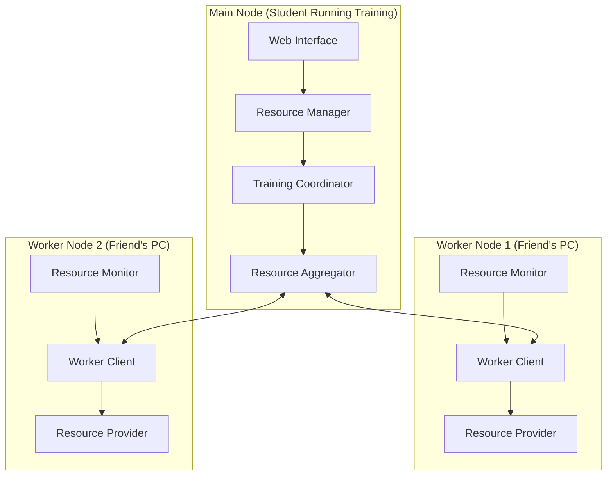
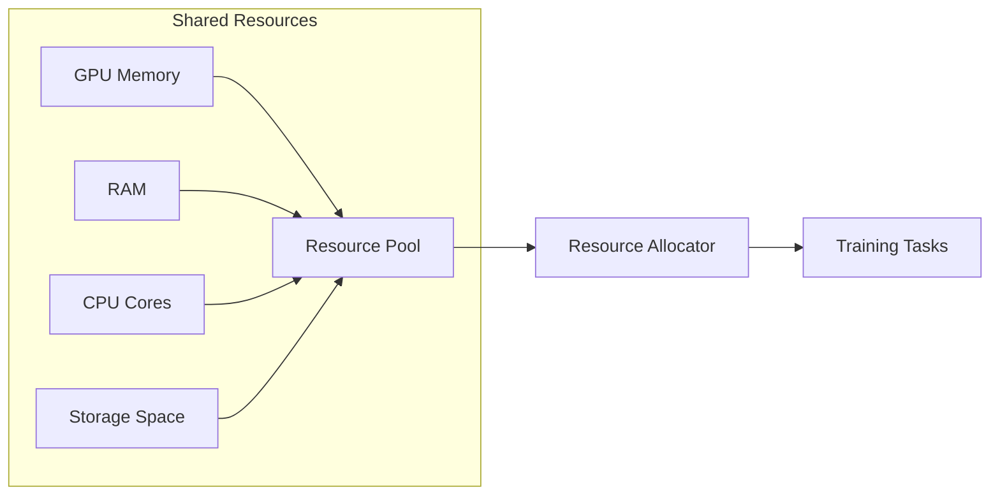
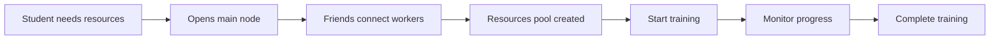

# FriendlyCompute 🤝

A Distributed Computing Resource Sharing System for Friends

## The Story Behind FriendlyCompute 📖

Imagine this scenario:

Your friend Raj is working on this cool AI project, but his laptop with 8GB GPU is struggling to handle it. He messages your study group:

> "Hey guys, I'm trying to train this huge model, but my laptop's dying! 😅 Anyone free to help?"

Here's where FriendlyCompute comes in:

- Three of his friends (including you) are free and say "Sure!"
- Everyone just opens this simple app we're building
- Raj uploads his model to his laptop (the main computer)
- You and other friends click "Connect" on your laptops

**BAM! 🚀** Now Raj's laptop can use:
- Combined GPU power (like combining 4 x 8GB = 32GB GPU!)
- Extra RAM from everyone's laptops
- More CPU power for data processing
- Even some hard drive space if needed

The cool part? It's super casual:
- No complex setup
- No scheduling
- Just friends helping friends
- Anyone can disconnect if they need their computer back
- The system automatically adjusts and continues working

Think of it like sharing notes, but instead, you're sharing computer power! No more buying expensive Colab Pro subscriptions or waiting forever for free Colab to work - just friends pooling their resources together.

## System Architecture 

### Overview Diagram

### Resource Sharing Components

## System Components 🛠️

### 1. Main Node (Training Coordinator)
- **Purpose**: Orchestrates resource sharing and training process
- **Components**:
  - Resource Manager
    - Tracks available resources (GPU, RAM, CPU, Storage)
    - Manages worker connections
    - Handles resource allocation
  - Training Manager
    - Distributes workload based on available resources
    - Manages training process
    - Aggregates results
  - User Interface
    - Simple web dashboard
    - Resource monitoring
    - Training controls

### 2. Worker Nodes
- **Purpose**: Share computing resources
- **Components**:
  - Resource Monitor
    - Reports available resources
    - Monitors usage
  - Worker Client
    - Simple connect/disconnect
    - Resource sharing controls
    - Usage statistics

## How It Works 🔄

## Features ✨

### Resource Distribution
- **GPU Sharing**: Split large models across multiple GPUs
- **RAM Sharing**: Distributed data caching and processing
- **CPU Sharing**: Parallel processing tasks
- **Storage Sharing**: Dataset distribution and checkpoints

### Communication
- WebSocket-based protocol
- Auto-discovery on local network
- Real-time resource updates
- Simple connection management

## Requirements 📋

### Network
- Local network connectivity
- Standard home/university network speeds
- Basic port accessibility

### Security
- Trust-based system
- Local network only
- Resource usage limits

### Scalability
- Optimized for 3-5 participants
- Dynamic resource addition/removal
- Fault-tolerant design

## Contributing 🤝

We welcome contributions! Feel free to:
- Report bugs
- Suggest features
- Submit pull requests

## License 📄

[MIT License](LICENSE)

## Support 💬

Join our community:
- Create an issue for bug reports
- Discussions for general questions
- Pull requests for contributions

---

Built with ❤️ for students, by students. Because sharing is caring! 🤝
> **Note:** This project is part of my Final Year College Submission (2024), currently in progress. 🎓
